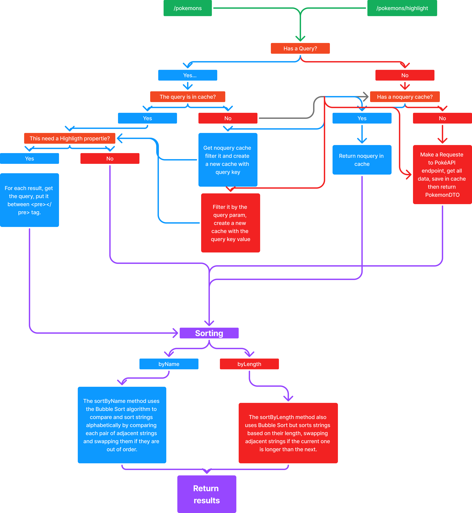

<h1>LooqBox Technical Test</h1>

This is an answer for the technical test by LooqBox

This project is a SpringBoot API that consumes PokéAPI

<h2>How to run it!</h2>

To run the project, you have two options: using Maven or Docker.

<h3>Option 1: Running with Maven</h3>
<ol>
    <li>Make sure you have Java 17+ and Maven installed on your system.</li>
    <li>Clone the project repository from GitHub: <code>git clone https://github.com/EricksonLOOP/Looqbox-Challenge.git</code></li>
    <li>Navigate to the project directory: <code>cd project-directory</code></li>
    <li>Build the project using Maven: <code>mvn clean install</code></li>
    <li>Run the project: <code>mvn spring-boot:run</code></li>
    <li>Access the API via <code>http://localhost:8080</code></li>
</ol>

<h3>Option 2: Running with Docker</h3>
<ol>
    <li>Make sure you have Docker installed on your system.</li>
    <li>Clone the project repository from GitHub: <code>git clone https://github.com/EricksonLOOP/Looqbox-Challenge.git</code></li>
    <li>Navigate to the project directory: <code>cd project-directory</code></li>
    <li>Build and run: <code>docker-compose up --build</code></li>
    <li>Access the API via <code>http://localhost:8080</code></li>
</ol>

<h2>Endpoints</h2>
<li><b>GET</b> /pokemon</li>

    <h5>Params</h5>
    <pre><b>query: String | Required: false</b></pre>
    <pre><b>sort: String | Required: false | Variants: "alphabetical" - "length"</b></pre>

    <h5>Return</h5>
    

   <code><pre>
<b>HTTP STATUS: 200</b>
return:[
List< <b>PokemonDTO</b> >
]
</pre></code>
    

    

   <code><pre>
<b>HTTP STATUS: 500</b>
"Error fetching pokemons" 
</pre></code>
    

<li><b>GET</b> /pokemons/highlight</li>

    <h5>Params</h5>
    <pre><b>query: String | Required: false</b></pre>
    <pre><b>sort: String | Required: false | Variants: "alphabetical" - "length"</b></pre>

    <h5>Return</h5>
    

   <code><pre>
<b>HTTP STATUS: 200</b>
return:[
List< <b>Pokemon</b> >
]
</pre></code>
    

    

   <code><pre>
<b>HTTP STATUS: 500</b>
"Error fetching pokemons" 
</pre></code>
    

<h2>Main Objects</h2>
<li><b>PokemonDTO</b></li>
<code>
<pre>
    List< String > results
</pre>
</code>
<li><b>Pokemon</b></li>
<code>
<pre>
    String name;
    String highlight;
</pre>
</code>

<h2>Fluxogram</h2>

